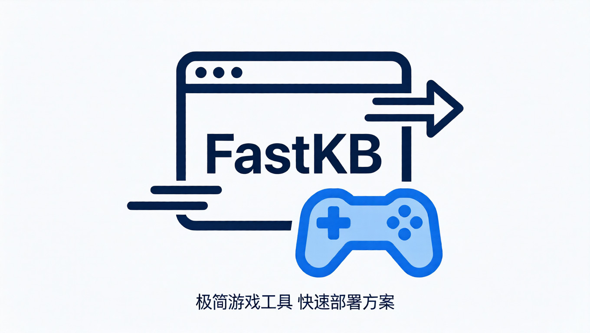

# FastKB 网页虚拟键盘插件 | 基于油猴Tampermonkey

 

**一款面向网页游戏与云游戏场景的高度可定制化虚拟触控手柄，支持自由布局、可视化编辑、宏录制、智能连发、手势操作、多配置管理等二十余项实用功能，专为触屏设备优化操控体验**
---

## 功能特点

- **完全自由布局** – 每个按钮都是独立元素，可在编辑模式下拖拽到屏幕任意位置，位置自动保存。
- **双击编辑** – 编辑模式下双击按钮弹出浮动工具栏，实时调整大小、颜色、按键映射、显示文本，并可通过连接线直观指示关联。
- **连发防检测** – 支持CPS（每秒次数）设置，可添加随机偏移，让连发间隔更自然，避免被游戏检测。
- **宏录制与回放** – 录制按键操作序列（包括按键按下与释放），可保存并回放，支持自定义步进延迟。
- **手势控制** – 滑动屏幕可触发预设宏（提供框架接口，可自行扩展）。
- **自动连点** – 定时自动点击指定按键，CPS可调，可用于挂机或快速点击。
- **屏幕锁定** – 锁定移动设备屏幕方向（需用户手势授权）。
- **游戏模式** – 禁用页面滚动，提升全屏游戏体验。
- **长按触发** – 设置长按时间（毫秒），长按按钮可触发额外功能（如开启连发）。
- **鼠标模拟** – 用按钮模拟鼠标点击事件（框架接口，可自定义实现）。
- **配置文件管理** – 创建、重命名、删除多个配置文件，每个配置独立保存按键布局和设置。
- **快速切换配置** – 通过自定义快捷键循环切换配置文件，界面实时刷新。
- **隐藏键盘** – 一键隐藏所有按钮（完全透明且不可点击），不影响页面操作。
- **边缘吸附** – 拖动按钮时自动吸附到屏幕边缘，吸附距离可调。
- **控制条自定义** – 顶部控制条可调整颜色、宽度、高度、水平偏移位置（支持像素或百分比）。
- **按键列表直接编辑** – 在设置面板的“按键”选项卡中，可集中查看、修改、添加、删除所有按钮属性。
- **导出/导入配置** – 将全部配置（含所有配置文件）导出为JSON文件，或从文件导入，方便备份和分享。
- **振动反馈** – 支持设备振动（需硬件支持），可增强操作手感。
- **按键声音** – 点击按钮时发出简短蜂鸣声（使用Web Audio API，需用户首次交互）。
- **屏蔽系统按键** – 可选择阻止某些系统按键（如音量键）影响游戏（框架接口）。

---

## 安装方法

1. 安装浏览器扩展 **Tampermonkey**（[Chrome 版](https://chrome.google.com/webstore/detail/tampermonkey/dhdgffkkebhmkfjojejmpbldmpobfkfo) / [Firefox 版](https://addons.mozilla.org/firefox/addon/tampermonkey/)）。
2. 点击链接安装脚本→[FastKB 网页虚拟键盘插件](https://fastly.jsdelivr.net/gh/fastnow/FastKB@main/fastkb.user.js)。
3. 在 Tampermonkey 中新建脚本，粘贴代码并保存。
4. 刷新任意网页，页面顶部将出现红色控制条，点击即可打开设置面板。

---

## 使用方法

### 基本操作
- **单击按钮**：发送对应的键盘事件（例如方向键、空格、ESC等），按钮有按下动画和震动/声音反馈（若启用）。
- **拖拽按钮**：需先在设置中开启 **编辑模式**，然后长按按钮即可拖拽移动位置，松开后自动保存。
- **双击按钮**：编辑模式下，双击按钮（或在触摸屏上快速两次点击）弹出浮动编辑栏，可调整按钮属性，同时有一条高亮连接线连接按钮与编辑栏，便于识别。

### 控制条
- 顶部细条是控制中心，点击可打开/关闭设置面板。
- 按住控制条拖动可移动其位置（控制条本身也是拖拽柄）。
- 控制条样式可在设置中调整（颜色、宽度、高度、水平位置）。

### 设置面板
设置面板分为五个选项卡，点击顶部标签切换：

#### 常规
- **隐藏键盘**：开关所有按钮的可见性和交互性。
- **编辑模式**：开启后可拖拽按钮，双击按钮编辑。
- **震动反馈**：启用设备振动。
- **按键声音**：启用点击时的蜂鸣声。
- **边缘吸附**：拖拽按钮时自动靠边。
- **控制条宽度/高度/偏移**：滑块调整。
- **控制条颜色**：颜色选择器。
- **控制条水平位置**：输入框（支持`50%`或`200px`）。

#### 按键
- **添加按键**：创建一个新按钮，可立即在列表中编辑属性。
- **按钮列表**：列出所有按钮，每行可修改按键映射（key）、大小（30-120px）、背景色、锁定状态（锁定后不可拖拽/编辑），并可删除按钮。
- 修改后实时生效，并保存到当前配置。

#### 连发
- **启用连发**：开关连发功能。
- **CPS (每秒次数)**：设置连发频率，例如10表示每秒10次。
- **随机偏移(ms)**：为每次连发间隔添加随机偏移，使连发更自然，避免被检测。

#### 高级
- **手势控制**：启用后滑动屏幕可触发宏（需自行实现回调）。
- **宏录制**：勾选后开始录制按键操作，再次勾选停止录制；下方按钮可播放录制的宏。
- **自动连点**：定时自动点击空格键（可扩展），CPS可调。
- **屏蔽系统按键**：阻止某些按键影响游戏（需自行实现屏蔽列表）。
- **屏幕锁定**：尝试锁定屏幕方向（移动端需用户手势）。
- **鼠标模拟**：用按钮模拟鼠标点击（框架）。
- **游戏模式**：禁用页面滚动。
- **长按触发时间**：设置长按时间（毫秒），长按按钮时可触发额外逻辑。
- **双击间隔**：设置识别双击的时间阈值。
- **快速切换快捷键**：设置一个快捷键（如`F5`），按下后循环切换配置文件。
- **导出配置**：将全部配置文件导出为JSON文件。
- **导入配置**：从JSON文件导入配置（会覆盖当前配置）。

#### 配置
- **配置文件下拉框**：选择要切换的配置文件。
- **保存**：将当前修改保存到活动配置。
- **新建**：创建新配置文件，可基于当前配置克隆。
- **重命名**：修改当前配置名称（默认配置不可重命名）。
- **删除**：删除当前配置（默认配置不可删除）。
- **重置当前配置为默认**：将活动配置恢复为默认值。

---

## 宏录制与播放

1. 在 **高级** 选项卡中勾选 **宏录制**，此时开始录制按键操作。
2. 点击任意按钮（或使用物理键盘），每次按键按下和释放都会被记录，并自动添加默认延迟（100ms）。
3. 再次勾选 **宏录制**（或点击“停止录制”按钮）结束录制，此时宏步骤保存在内存中。
4. 点击 **播放宏** 按钮回放录制的按键序列。播放时会按记录的顺序和延迟执行按键事件。
5. 宏数据与当前配置文件绑定，切换配置或导出/导入时会一并保存。

*提示：可多次录制，每次录制会覆盖之前的内容。如需更复杂的宏编辑，可导出JSON后手动修改。*

---

## 配置文件管理

- **新建配置文件**：点击“新建”，输入名称，将基于当前配置创建一个新配置，并自动切换过去。
- **重命名配置文件**：点击“重命名”，输入新名称（默认配置不能重命名）。
- **删除配置文件**：点击“删除”，确认后删除当前配置，自动切换到默认配置。
- **保存当前配置**：点击“保存”，将当前所有设置和按键布局保存到活动配置文件中。
- **导出配置**：将所有配置文件（包括名称和内容）导出为一个JSON文件，可用于备份或分享。
- **导入配置**：选择一个JSON文件导入，会替换当前所有配置（请提前备份）。

---

## 快速切换配置快捷键

在 **高级** 选项卡中设置一个快捷键（默认 `F5`），之后无论何时按下该键，都会按顺序循环切换到下一个配置文件。切换时手柄界面会自动重建，反映新配置的布局和设置。

---

## 注意事项

- **移动端兼容性**：脚本针对触摸屏优化，但大多数功能在桌面端也可用（使用鼠标模拟触摸）。建议在移动设备上使用浏览器全屏模式获得最佳体验。
- **音频**：按键声音依赖 `AudioContext`，浏览器通常要求用户手势后音频才能播放，因此第一次点击按钮时可能无声音，后续正常。
- **振动**：仅在支持 `navigator.vibrate` 的设备上有效，部分桌面浏览器不支持。
- **屏幕锁定**：使用 `screen.orientation.lock` 需要用户手势（如点击按钮）且在安全上下文（HTTPS）中，移动端有效。
- **游戏模式**：会设置 `body` 和 `html` 的 `overflow: hidden`，如需退出请关闭该选项。
- **配置存储**：所有配置通过 Tampermonkey 的 `GM_setValue` 存储，数据量较大时请勿过于频繁保存。
- **与其他脚本冲突**：某些网站可能自带键盘拦截，若按键无效，可尝试在设置中启用“屏蔽系统按键”或调整按键映射。

---

## 声明

Copyright © 2026 FastNow Studio. All Rights Reserved.

---

*如需报告问题或贡献代码，请访问 GitHub Issues。*